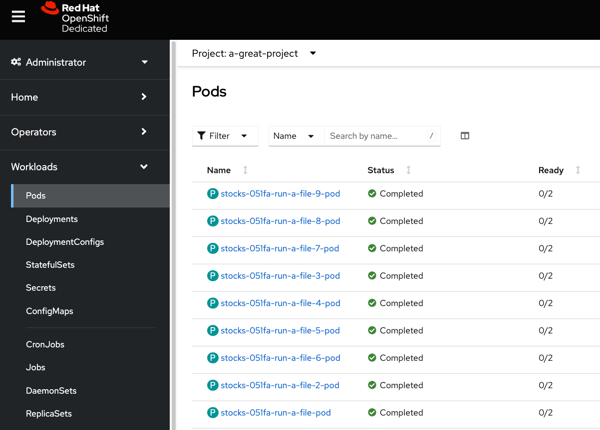

# DS-Pipelines-Samples

## stocks example

in the `./stocks/` directory.

Clone the project into your RHODS environment.

```bash
#%%bash
## uncomment the line above if you want to run this from a notebook cell
## ensure it's the very first line in the cell if you do
cd ~
git clone https://github.com/erwangranger/DS-Pipelines-Samples.git
cd ~/DS-Pipelines-Samples/stocks
git checkout morecomplex
```

Open the file called `stocks.pipeline` in the `stocks` directory.

Results should look like:


Execute the pipeline, and keep the default name.

And the results of a run in Object Storage will look like:


The run the RHODS Dashboard looks like:


View in the OpenShift console:


Pod View:

